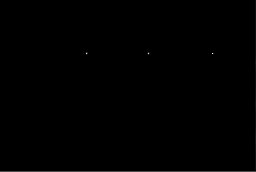

# Exercises - Lecture 2

## Exercise 1

1. Download lion.jpg and play around with the different filters in ImageJ. Discuss/show the effects of different kernel sizes.

## Exercise 2

1. Use OpenCV to load and display lion.jpg​
    1. Implement a mean filter with configurable kernel size​
    2. Extra: Implement a Gaussian blur filter with configurable kernel size​
2. Use OpenCV to load and display neon-text.png​. Use template matching to make an image which shows the positions of the three hearts, similar to the one below (the white dots showing the positions are very small, but there are three of them). Show the correlation image as an intermediate step.

Hint: Use a combination of the functions matchTemplate, normalize, and threshold

## Exercise 3

1. Play around with the different morphologic operations in ImageJ : Process -> Binary​
2. How can Morphology be used to find the outline (edge) of an object in a binary image? ​
3. Use morphology to improve the results from the previous lecture on the image dots.gif​

## Exercise 4

1. Imagine you are using the size of a BLOB as a feature in your project. In feature matching, you need to compare the model of the BLOB with the BLOB extracted from the image​.
   Find a way to normalize the feature matching, so the result always is in the interval: [0,1] (where 0 means a very poor match and 1 means a perfect match)​

## Exercise 5

1. Apply horisontal and vertical Sobel kernels to find edges in an image of your own choice (use the function Sobel())
   1. What are the results of using Sobel kernels on RGB vs grayscale images?
2. Test Canny edge detector on your own image
