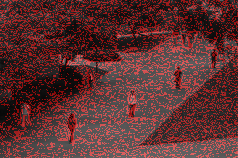
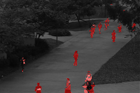
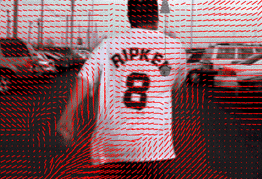

# Exercises - Lecture 4

## Exercise 1

1. Download the UCSD Anomaly Detection Dataset from here: <http://www.svcl.ucsd.edu/projects/anomaly/dataset.html> (also available under Exercise Materials on the main course page)
2. Pick a sequence to work with, e.g. `UCSDped1\Test\Test016` (which is good, because it's not too crowded). Use the first picture as background and make a program where you can flip through all pictures and the difference will be highlighted in red, like this:
   
3. But that is horrible! You can do better. Compute an average background image and apply that with your program:
   
4. Use [`cv::BackgroundSubtractorMOG2`](https://docs.opencv.org/master/d7/d7b/classcv_1_1BackgroundSubtractorMOG2.html) to do the background subtraction instead of your own method.

## Exercise 2

1. Download the video from here: <https://www.bogotobogo.com/python/OpenCV_Python/images/mean_shift_tracking/slow_traffic_small.mp4> (also available under Exercise Materials on the main course page)
2. Compute optical flow with Lucas Kanade and GoodFeaturesToTrack ([hint](https://github.com/opencv/opencv/blob/master/samples/python/tutorial_code/video/optical_flow/optical_flow.py), [hint](https://github.com/opencv/opencv/blob/master/samples/cpp/tutorial_code/video/optical_flow/optical_flow.cpp))
3. Instead of colored tracks, make your program output those cool optical flow arrows ([hint: you need dense optical flow for this, so use Färnebäck for this](https://github.com/opencv/opencv/blob/master/samples/python/tutorial_code/video/optical_flow/optical_flow_dense.py)):
   
